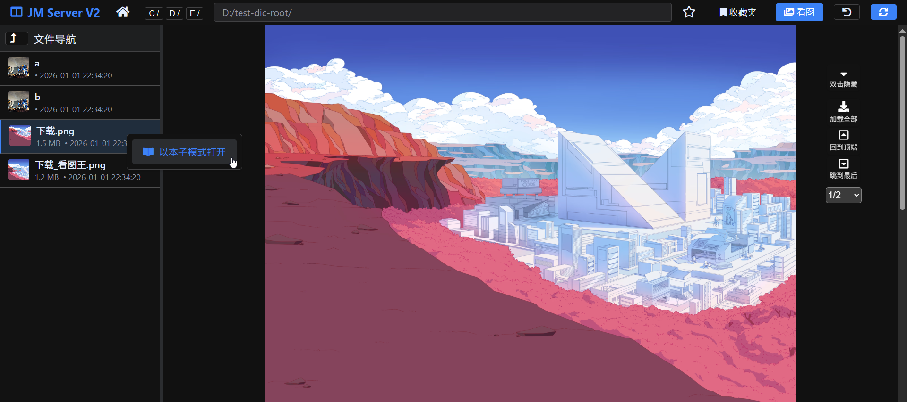
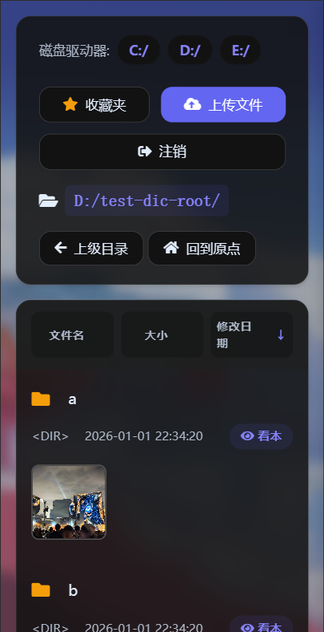

# plugin-jm-server

“离线版”禁漫天堂

该项目会在本地起一个`文件服务器`，支持用浏览器查看文件夹内的图片，界面模仿禁漫的章节观看页面，并适配手机端。

用浏览器的好处就是支持很多浏览器插件和脚本，例如：

* 双页阅读插件：https://sleazyfork.org/zh-CN/scripts/374903-comicread

# 效果图（文件浏览、整章看图）

## 1. 电脑浏览器访问

### 登录页


### 文件夹列表页


### 看本模式


### 文件夹&看本 二合一模式


## 2. 手机浏览器访问

### 登录页


### 文件夹列表页


### 看本模式


# 使用方式


## 1. pip安装

```shell
pip install plugin_jm_server
```


## 2. 运行代码

* **HTTP版**

```python
from plugin_jm_server import *

# http
server = JmServer(
    'D:/',
    'password',
)
server.run(
    host='0.0.0.0',
    port=80,
)
```

* **HTTPS版**

```python
from plugin_jm_server import *

# https
server = JmServer(
    'D:/',
    'password',
)
server.run(
    host='0.0.0.0',
    port=443,
    ssl_context='adhoc',
)
```

* 作为jmcomic的插件

```yml
# 配置文件
plugins:
  after_init: 
#  after_album:
    - plugin: jm_server
      kwargs:
        password: ''

```

```python
# 代码
from jmcomic import *

op = create_option('op.yml')
op.download_album(123)
# 运行到这里，虽然主线程代码执行完毕，但程序不会退出，因为服务器线程还没有结束。
# 控制台会输出提示信息如下（atexit时输出的）：
# “主线程执行完毕，但插件jm_server的服务器线程仍运行中，可按下ctrl+c结束程序”
# 此时需要你主动按下ctrl+c终止程序。

# python 3.12 特别注意：需要插入下面这行代码，服务器才能继续处理请求
op.wait_all_plugins_finish()
```


## 前端页面与功能介绍

本项目提供了一套完整的 Web 前端界面，用于管理和浏览本地图片资源。主要包含以下三个核心页面及其功能：

### 1. 登录页
为了保护个人隐私，系统提供了简单的访问控制。
*   **密码验证**：启动时可配置密码，访问时需校验通过。
*   **设备自适应**：根据访问设备（手机/电脑）自动适配最佳的登录布局。

### 2. 文件夹浏览页（主页）
这是资源管理的核心入口，支持高效的文件查找与导航。目前最新版本采用了 SPA（单页应用）架构进行全面增强：
*   **智能路径导航**：
    *   **路径补全**：输入路径时自动联想下级文件夹，支持键盘上下键选择及回车跳转。
    *   **层级跳转**：输入框支持“..”快速返回上一级，并提供“确认”按钮进行精准跳转。
*   **可视化展示**：
    *   **文件夹预览**：鼠标悬停在文件夹上时，会自动展示该文件夹内的首张图片作为封面预览。
    *   **类型区分**：通过文件夹角标（图标）清晰区分普通文件夹与特殊资源文件夹。
*   **辅助功能**：
    *   **书签管理**：支持将常看目录加入左侧书签栏，方便下次快速访问。
    *   **本地交互**：支持通过网页菜单直接打开服务器端对应的本地文件夹窗口（Explorer）。

### 3. 图片阅读页（看本模式）
专为漫画阅读优化的沉浸式浏览页面。
*   **加载优化**：采用图片懒加载机制，流畅浏览含有数百张图片的大型章节，节省系统资源。
*   **多端适配**：
    *   **PC端**：适合大屏浏览，支持浮动工具栏进行页面跳转、全屏切换等。
    *   **移动端**：适配触摸操作，提供更好的手机阅读体验。
*   **阅读辅助**：
    *   **浮动菜单**：提供“回到顶部”、“加载全部图片”及“在资源管理器打开”等便捷操作。
    *   **键盘支持**：支持常用快捷键进行页面滚动和翻页。

#  想法起源

想法起源：https://github.com/hect0x7/JMComic-Crawler-Python/issues/192

基于原项目：https://github.com/AiCorein/Flask-Files-Server

为了方便修改，将原项目中的文件复制到本项目中，然后进行修改
