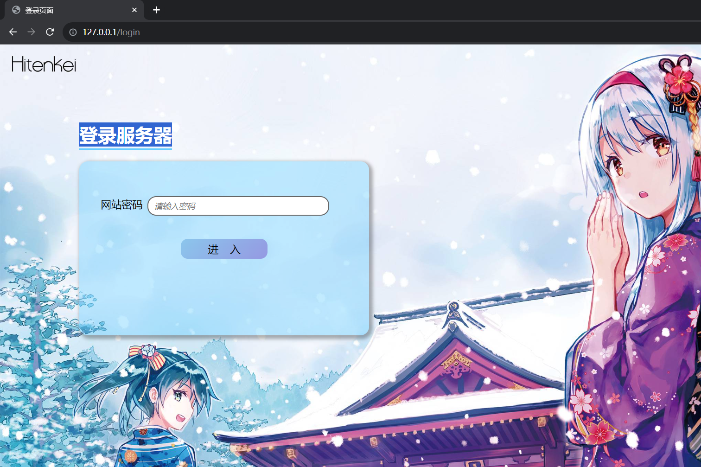
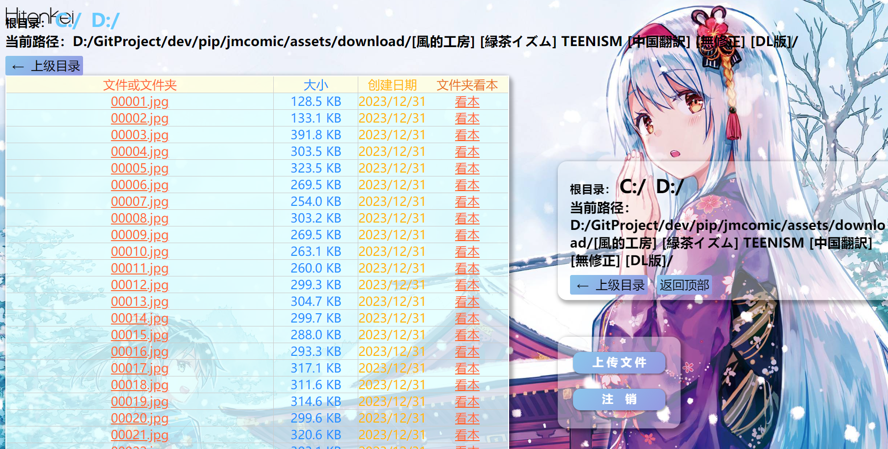
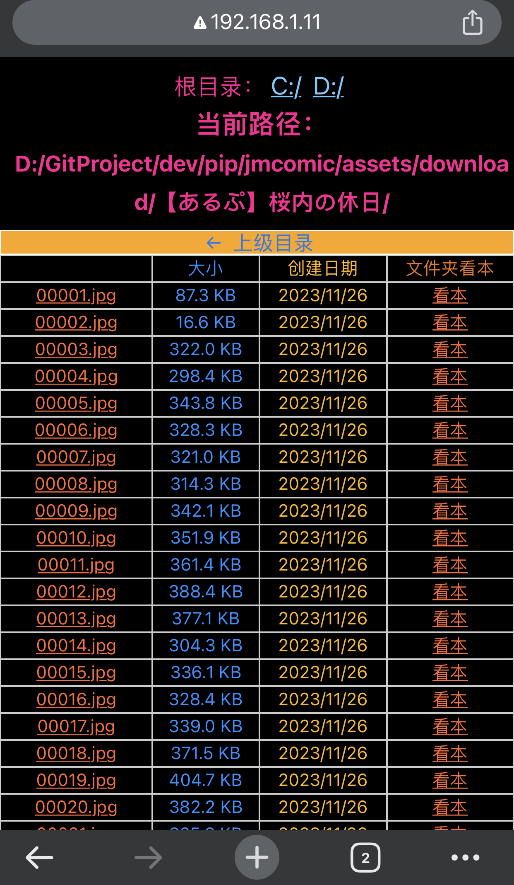

# plugin-jm-server

“离线版”禁漫天堂

该项目会在本地起一个`文件服务器`，支持用浏览器查看文件夹内的图片，界面模仿禁漫的章节观看页面，并适配手机端。

#  想法起源

想法起源：https://github.com/hect0x7/JMComic-Crawler-Python/issues/192

基于原项目：https://github.com/AiCorein/Flask-Files-Server

为了方便修改，将原项目中的文件复制到本项目中，然后进行修改


# 可优化点

1. 前端优化。目前项目架构是`前后端不分离架构`，前端使用原始的html三件套。可以优化为前后端分离架构，基于Vue等开发框架，复用组件库，优化界面。

2. 后端优化。支持提供调用jmcomic功能的后端接口。


# 使用方式


## 1. pip安装

```shell
pip install plugin_jm_server
```


## 2. 运行代码

* **HTTP版**

```python
from plugin_jm_server import *

# http
server = JmServer(
    'D:/',
    'password',
)
server.run(
    host='0.0.0.0',
    port=80,
)
```

* **HTTPS版**

```python
from plugin_jm_server import *

# https
server = JmServer(
    'D:/',
    'password',
)
server.run(
    host='0.0.0.0',
    port=443,
    ssl_context='adhoc',
)
```

* 作为jmcomic的插件

```yml
# 配置文件
plugins:
  after_init: 
#  after_album:
    - plugin: jm_server
      kwargs:
        password: ''

```

```python
# 代码
from jmcomic import *

op = create_option('op.yml')
op.download_album(123)
# 运行到这里，虽然主线程代码执行完毕，但程序不会退出，因为服务器线程还没有结束。
# 控制台会输出提示信息如下（atexit时输出的）：
# “主线程执行完毕，但插件jm_server的服务器线程仍运行中，可按下ctrl+c结束程序”
# 此时需要你主动按下ctrl+c终止程序。

# python 3.12 特别注意：需要插入下面这行代码，服务器才能继续处理请求
op.wait_all_plugins_finish()
```


# 效果图（文件浏览、整章看图）

## 1. 电脑浏览器访问




## 2. 手机浏览器访问




